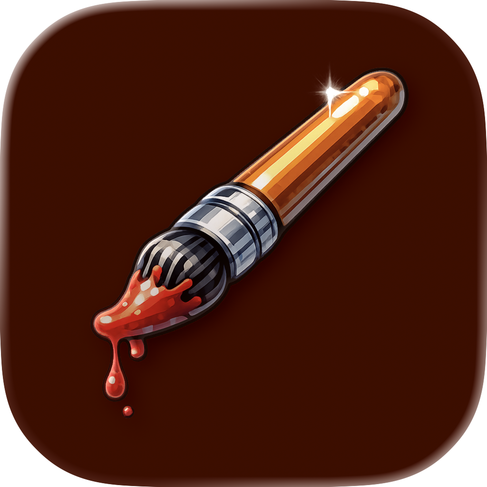

# Blot


A bitmap image editor for macOS. Simple. Native. No bloat.

---

## What is this?

Blot is a straightforward bitmap image editor built entirely with Swift, SwiftUI, and AppKit. No Electron. No web views. No 500MB runtime for a paint program.

It's the kind of app that should exist on every Mac but doesn't—a simple, fast, native tool for when you just need to draw something, edit a screenshot, or make a quick diagram without launching a subscription-based behemoth.

## Philosophy

I believe in software that:

- **Respects your machine.** Native code, native frameworks, native performance.
- **Does one thing well.** This is a bitmap editor. It edits bitmaps. That's it.
- **Gets out of your way.** No accounts. No cloud. No "helpful" AI suggestions. Just pixels.
- **Looks like it belongs.** Floating palettes, proper menu bar integration, keyboard shortcuts that make sense.

If you've ever used MS Paint on Windows XP and wondered why nothing that simple exists on Mac—this is for you.

## Features

### Tools (All 16 of them)
| Tool | Shortcut | Description |
|------|----------|-------------|
| Free-Form Select | `S` | Lasso selection |
| Rectangle Select | `⇧S` | Rectangular selection |
| Eraser | `E` | Erases to background color |
| Fill | `G` | Flood fill |
| Color Picker | `I` | Eyedropper tool |
| Magnifier | `Z` | Zoom in/out |
| Pencil | `P` | 1px freehand drawing |
| Brush | `B` | Variable-width brush |
| Airbrush | `A` | Spray paint effect |
| Text | `T` | Add text to canvas |
| Line | `L` | Straight lines |
| Curve | `C` | Bézier curves (click to bend) |
| Rectangle | `R` | Rectangles and squares |
| Polygon | `Y` | Multi-sided shapes |
| Ellipse | `O` | Circles and ellipses |
| Rounded Rectangle | `⇧R` | Rounded corners |

### Shape Styles
All shape tools support three styles:
- Outline only
- Filled with outline
- Filled without outline

### File Formats
**Open:** PNG, JPEG, BMP, TIFF, GIF, and `.blot` (native format)

**Export:** PNG, JPEG, TIFF, BMP, GIF, PDF

### Keyboard Shortcuts

| Action | Shortcut |
|--------|----------|
| Show Tools Palette | `⌘1` |
| Show Colors Palette | `⌘2` |
| Show Navigator | `⌘3` |
| Show All Palettes | `⌘0` |
| Hide All Palettes | `⇧⌘0` |
| Increase Brush Size | `]` |
| Decrease Brush Size | `[` |
| Resize Canvas | `⇧⌘R` |
| Flip Horizontal | `⇧⌘H` |
| Flip Vertical | `⇧⌘V` |
| Invert Colors | `⌘I` |
| Clear Canvas | `⌘⌫` |

### Interface
- **Floating tool palette** — Stays out of your way, shows tool options contextually
- **Floating color palette** — 28-color palette + custom color picker, foreground/background colors
- **Navigator panel** — Thumbnail view of your entire canvas
- **Drag-to-resize canvas** — Grab the handles and pull
- **Full screen support** — Palettes follow you into full screen mode

## Requirements

- macOS 13.0 (Ventura) or later
- Apple Silicon or Intel Mac

## Installation

### Download
Grab the latest release from the [Releases](https://github.com/suobset/blot/releases) page.

### Build from Source
```bash
git clone https://github.com/suobset/blot.git
cd blot
open Blot.xcodeproj
```

Then hit `⌘R` in Xcode.

## Why?

Because I wanted a simple paint program on my Mac and everything available was either:
- A web app pretending to be native
- An Electron app eating 800MB of RAM
- A "free trial" for software that costs $20/month
- Way too complicated for drawing a red circle on a screenshot

So I built one. In a weekend. With vibes.

## Tech Stack

- **Swift** — Because it's 2026 and Objective-C is for maintaining legacy code
- **SwiftUI** — For the UI components that benefit from declarative syntax  
- **AppKit** — For the parts that need real control (canvas rendering, floating panels)
- **Core Graphics** — For actual pixel manipulation
- **No dependencies** — Just Apple frameworks.

## Contributing

PRs welcome. Keep it simple. If your feature needs a settings panel with 47 options, it probably doesn't belong here.

## License

MIT License. Do whatever you want with it.

See [LICENSE](LICENSE) for the full text.

## Author

**Kushagra Srivastava**

- [skushagra.com](https://skushagra.com)
- [GitHub](https://github.com/suobset)

---

